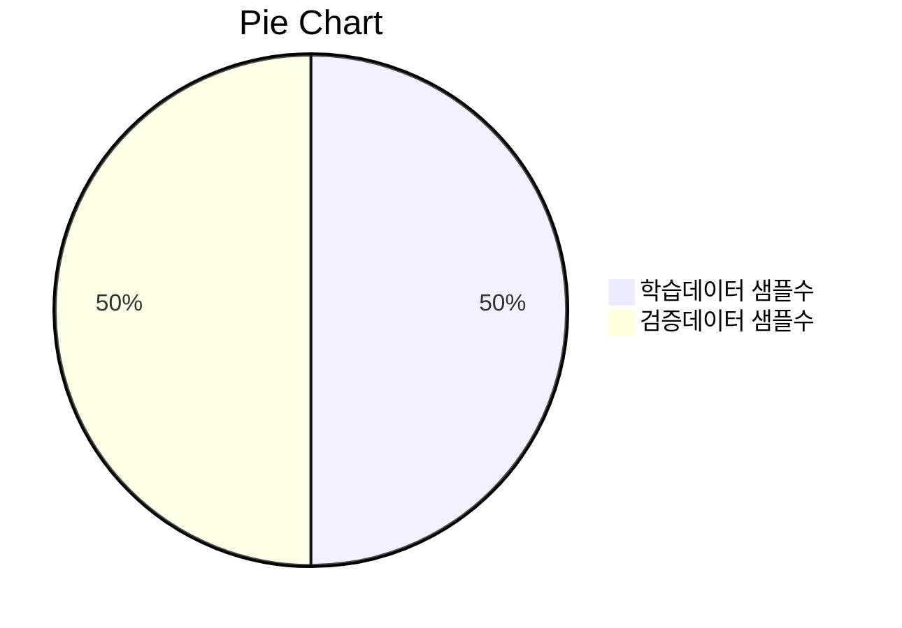

# 한국어 NER 추론 모델

## 학습에 사용한 base model
```bash
  https://huggingface.co/klue/roberta-large/
```

## NER 
```bash
  https://www.kaggle.com/code/eriknovak/pytorch-roberta-named-entity-recognition/notebook
```

## TODO, 학습 샘플수

